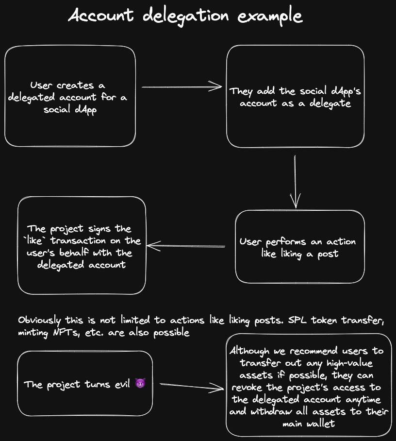

# Account Delegation

Having to approve transactions for simple actions like liking a post on a social dApp is impractical. With account delegation, users can create a delegated account and add the project as a delegate which can sign transactions on the user's behalf.

## How it works

- Users crate a delegated account (this is scoped to the specific project like a social a dApp) and adds the project as a delegate
- The project can now sign transactions on the user's behalf
- The user can remove this delegate at any time and the project will no longer be able to sign transactions on the user's behalf
- The user can also withdraw all assets from the delegated account to their wallet at any time

---

---

### Use cases

We mostly see this being used in social dApps and on-chain games where it will be too much friction for the user to approve transactions for even minute interactions. However, for applications like DeFi where transaction volume is not much and assets at stake is quite high, it is better to use a normal wallet or RayAuth non-custodial wallet.
