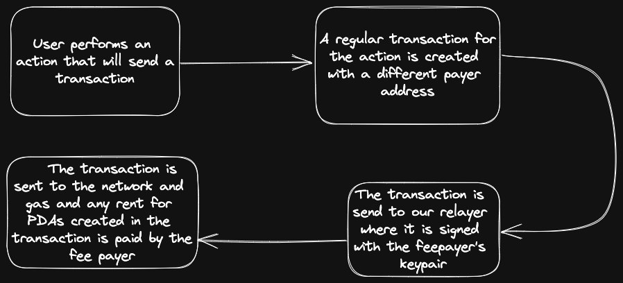

# Gasless Transactions

The biggest problem for new users interacting with dApps is that they typically don't have SOL to pay gas fees for any transaction. Since gas fees are very low in Solana (< 0.001 USD), the applications that the user is interacting with can easily pay the gas fees on behalf of the user.

With RayAuth, projects get their account that they fund with SOL (this is called the gas tank but is also used as the project account for [Account Delegation](/architecture/account-delegation)).

This gas tank account is set as the fee payer for gasless transactions and sent via our relayer node where they are signed with the gas tank's keypair.

