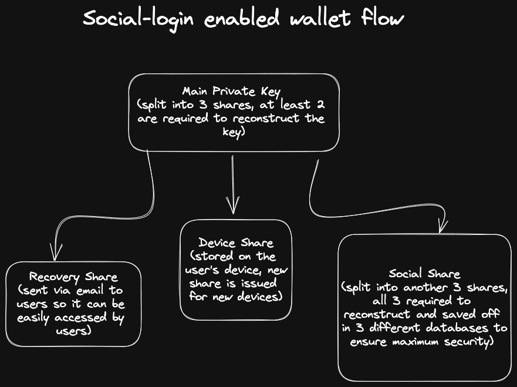

# The non-custodial wallet

We create a regular Solana keypair which consists of a public key and a private key. Instead of storing this private key like most custodial wallet solutions, we split it into 3 shares -

### Device Share

This share is stored on the user's browser. A new share is issued for each new device (or browser) they login from.

### Recovery Share

This share is sent via email to the user. It acts as an easily accessible and safe backup key. Whenever the user logs in to a new device (or browser), they are asked to enter the recovery share as it is used to issue a new device share.

### Social Share

This share is further 3 shares and stored in 3 differenet databases to ensure maximum security. All 3 shares need to be obtained for the social share to be reconstruced. This happens automatically when a user logs in with there social login method but if any 1 or even 2 of the databases were to be compromised, the social share wouild remain safe.

---

At least 2 of these 3 shares are required to reconstruct the main private key. Typically this will be a combination of the social share and the device share. The private key is never stored anywhere, even when the user is logged in, rather reconstruced on the fly using the shares. When the user logs in to a new device, the social share and the recovery share are used to reconstruct the private key and issue a new share.

---

